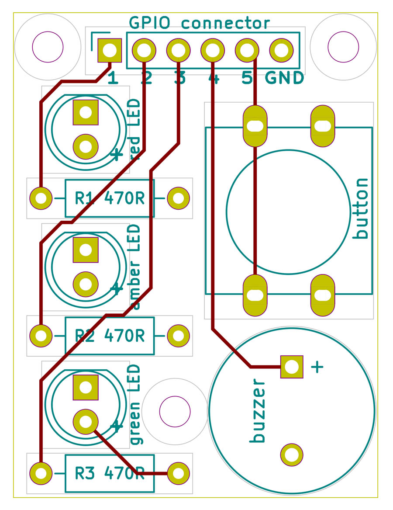
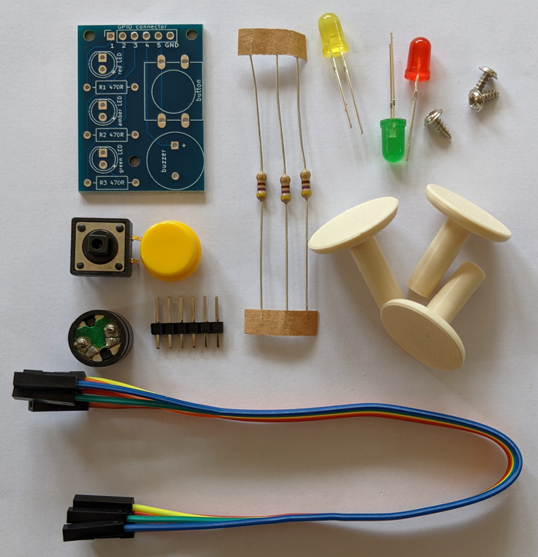
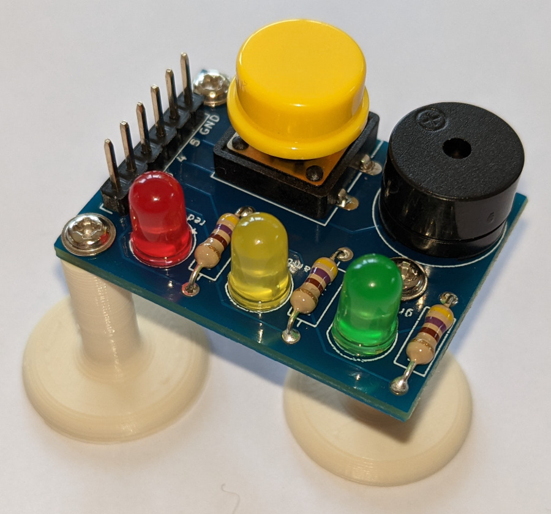

# Starter Maker PCB
 Documentation plus Raspberry Pi and microcontroller code for a starter level digital maker PCB.

 &nbsp; &nbsp; 

A 'starter' maker PCB that uses just a few basic electronic components, as shown above, and can be connected to any of the main single board computer (SBC) Raspberry Pi's or a number of different microcontrollers - [more detailed project information here](https://onlinedevices.org.uk/Starter+Maker+PCB) and the designs for an associated custom 3D printed component can be downloaded from [here](https://www.prusaprinters.org/prints/67963-pcb-support-foot)

The code allows a number of different projects to be explored by a 'starter' digital maker.
 - Scratch and Python code is available for the family of Raspberry Pi SBCs,  
 - Arduino IDE (C/C++) for the Raspberry Pi Pico, ESP8266 and ESP32 microcontrollers, plus 
 - MicroPython code for the Raspberry Pi Pico.

## Custom PCB design

The custom PCB (v1.0) was designed using KiCAD and the layout has been defined to allow a connector to attach to any Raspberry Pi and a range of microcontrollers, and a set of components that are needed to build a fully populated module.

 &nbsp; &nbsp;  &nbsp; &nbsp;   

Gerber files for the PCB design can be downloaded from the PCB_design_files folder.

## Raspberry Pi SBC code
The code and documentation has been updated to allow for a generalised username instead of the previous default username 'pi', and for the use of Python using the Bookworm OS the use of a Virtual Environment is described. 

Two installation scripts are also provided that not only download all the code and documentation but also install all the various libraries/modules needed by the code.

Example code is provided for the Pi offline versions 1.4, 2 and 3 of Scratch so that any version of a Raspberry Pi SBC that can run Scratch in some form has an option.

Python example code can usually be run using the Thonny IDE on a Raspberry Pi SBC but suggested CLI commands for the user are also provided in the code as a comment where the installed folders are assumed to be:
/home/YOURUSERNAME/starter_maker_PCB1/RPi_code/starter_ebasics/ for the electronic basics code, and
/home/YOURUSERNAME/starter_maker_PCB1/RPi_code/image_taking/ for the image taking code

The image taking code also assumes various folders for the storage of different types of 'taken' images and these folders are not always auto-created so the code should be checked so that the appropriate folders can be created before the code is run.

## Raspberry Pi Pico microcontroller code
Both MicroPython and Arduino IDE (C/C++) example code are provided in separate folders, plus two .zip files are provided in the documentation folder that each conveniently have the code, the main user documentation PDF and short MicroPython or C/C++ usage PDF notes.

## ESP32 microcontroller code
Just Arduino IDE (C/C++) example code is provided in a separate folder that was developed and tested using a 38pin ESP32 microcontroller module. In addition a .zip file is provided in the documentation folder that conveniently has the code, the main user documentation PDF and a short C/C++ usage PDF note.

For the buzzer_player and LED1_flash_web example code, 'data' is used that needs to be loaded into the microcontroller SPIFFS before compiling and uploading the code.

## ESP8266 microcontroller code
Just Arduino IDE (C/C++) example code is provided in a separate folder that was developed and tested using a 30pin ESP8266 microcontroller NodeMCU v1.0 module. In addition a .zip file is provided in the documentation folder that conveniently has the code, the main user documentation PDF and a short C/C++ usage PDF note.

For the buzzer_player and the various versions of the LED1_flash_web*** example code, 'data' is used that needs to be loaded into the microcontroller SPIFFS before compiling and uploading the code.
